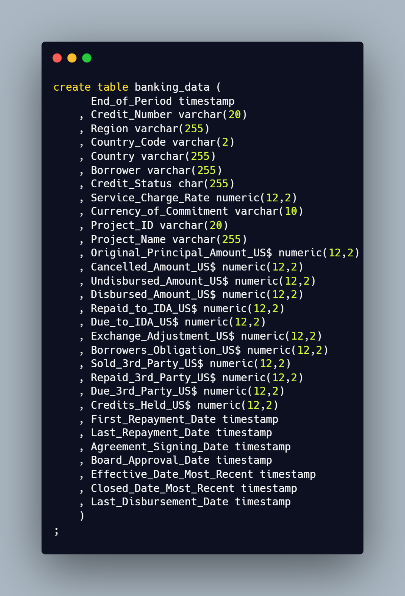
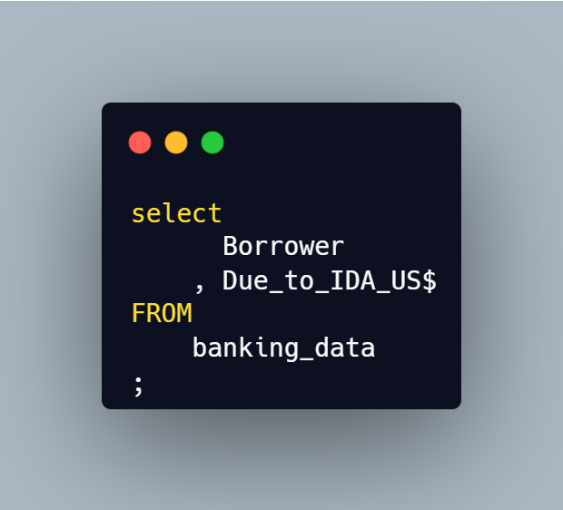
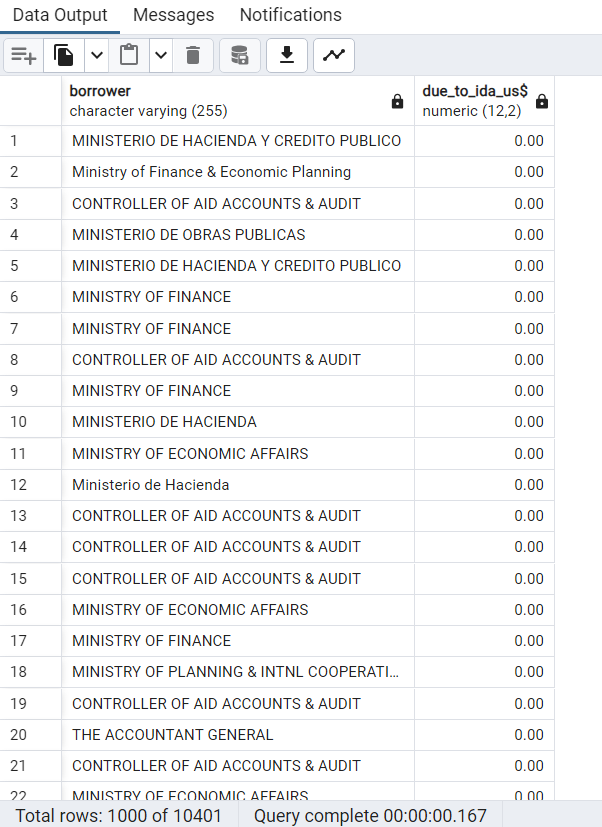

# Bank Project

This is my bank project. In this SQL project, I leverage PostgreSQL to explore into a bank dataset, addressing diverse inquiries. 

---

## Creating the Table   
I began by downloading the dataset CSV file from [World Bank's finances](https://finances.worldbank.org/Loans-and-Credits/IDA-Statement-Of-Credits-and-Grants-Historical-Dat/tdwh-3krx/about_data) and proceeded to review the columns to ascertain their respective data types. Once categorized, I created a PostgreSQL table to organize the data accordingly.   
   

After verifying the accuracy of the "banking_data" table, I imported the data into the newly created table. A swift **SELECT*** query validated the successful transer of information.   

## Querying the Data   

After completing the data import, I proceeded to execute basic SQL commands to perform various queries. These commands included SELECT, WHERE, and ORDER BY, allowing me to retrieve specific information, filter results, and sort data as needed.  

1. I used the SELECT statement to choose specific columns "Borrower" and "Due_to_IDA_US$"   
   

